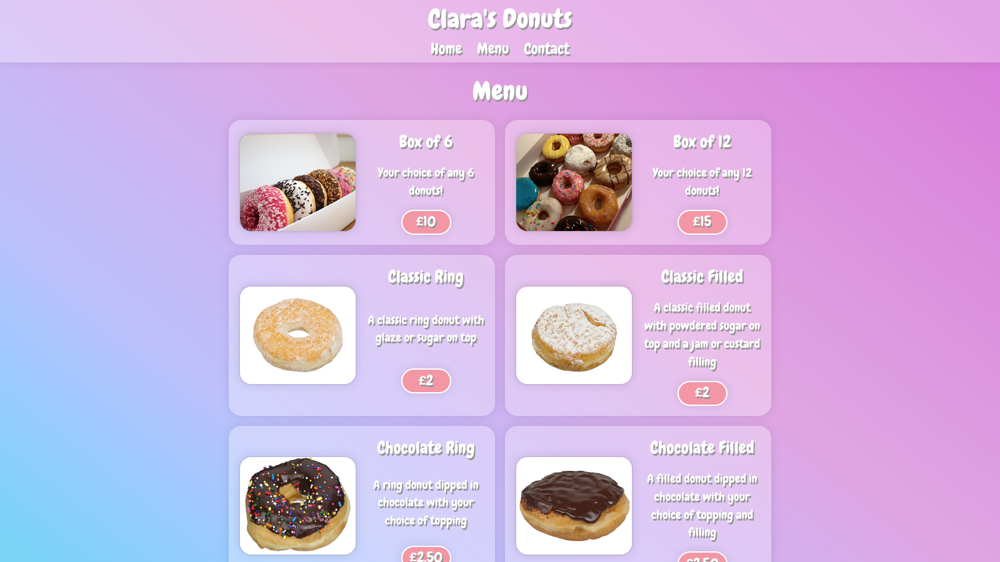

	<h1>Restaurant Page Project
	 
		
		
		
		
		 
	</h1>
	<h3><b><a href="https://clarasmyth.github.io/restaurant-page/">View Live Demo</a></b></h3>

## Description

This is a restaurant webpage created for an assignment as part of [TheOdinProject](https://www.theodinproject.com) curriculum to get familiar with using Webpack.

To see the assignment details - [Click Here](https://www.theodinproject.com/lessons/node-path-javascript-restaurant-page)

## Built Using

-   HTML5 
-   CSS3 
-   JavaScript 
-   Webpack 

## Credits

#### Images

-   <a href="https://pixabay.com/users/popcorn_pix-7815162/?utm_source=link-attribution&amp;utm_medium=referral&amp;utm_campaign=image&amp;utm_content=4917287">Paula Wood</a> from <a href="https://pixabay.com/?utm_source=link-attribution&amp;utm_medium=referral&amp;utm_campaign=image&amp;utm_content=4917287">Pixabay</a>
-   <a href="https://pixabay.com/users/wikimediaimages-1185597/?utm_source=link-attribution&amp;utm_medium=referral&amp;utm_campaign=image&amp;utm_content=2201810">WikimediaImages</a> from <a href="https://pixabay.com/?utm_source=link-attribution&amp;utm_medium=referral&amp;utm_campaign=image&amp;utm_content=2201810">Pixabay</a>
-   <a href="https://pixabay.com/users/dohnalovajane-11160395/?utm_source=link-attribution&amp;utm_medium=referral&amp;utm_campaign=image&amp;utm_content=5331966">dohnalovajane</a> from <a href="https://pixabay.com/?utm_source=link-attribution&amp;utm_medium=referral&amp;utm_campaign=image&amp;utm_content=5331966">Pixabay</a>
-   <a href="https://pixabay.com/users/anya1-52016/?utm_source=link-attribution&amp;utm_medium=referral&amp;utm_campaign=image&amp;utm_content=179248">anya1</a> from <a href="https://pixabay.com/?utm_source=link-attribution&amp;utm_medium=referral&amp;utm_campaign=image&amp;utm_content=179248">Pixabay</a>

## Gallery

#### Home page

#### Menu page

#### Contact page

#### Mobile view

